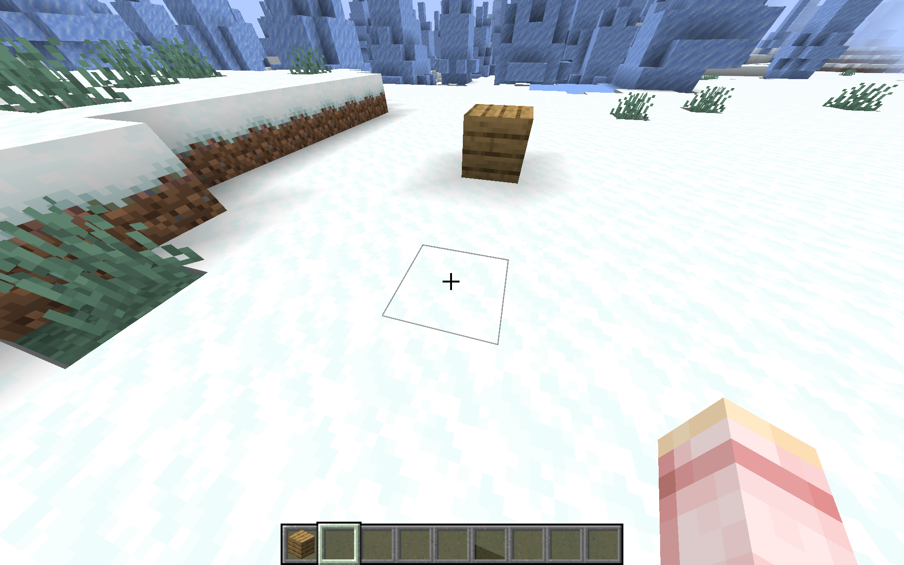
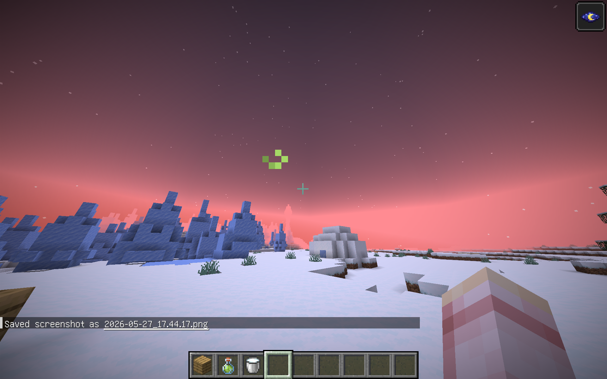
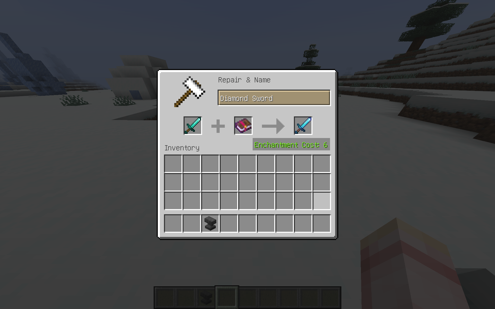

# GDIM 33 In-Class Activities
## W1
### Activity 1
1. https://docs.google.com/drawings/d/1Bz43Q08DGFOCgmofemXLwSxpZa4YqZLi2pbqFyB1qss/edit?usp=sharing
2. 
    (1) I love cities and buildings. I also love Japanese culture.
    (2) I cannot write this section because I was absent.
    (3) I cannot write this section because I was absent.
    
### Activity 2
(1) Papers, please-like
(2) A player works as a customs officer at an international airport in a fictional country. Travelers arrive one by one with passports, customs declaration forms, and luggage. The player must inspect each traveler, compare their documents with their appearance and baggage scan, and identify suspicious or anomalous traits before making a decision.
(3) https://docs.google.com/drawings/d/1NhbZnd_Kp8Ws2vqgfMxpA9pnqVoGAwDLbI3lQ5wfBoE/edit?usp=sharing

## W2
Write your W2 Devlog here.

Continue adding additional headers below this one for future weeks and future activities.

## W3
### Activity 1
https://drive.google.com/file/d/1tpfWW5tAJHiwwRU3NEbRoLNp9CLIksdd/view?usp=sharing

### Activity 2
1. Saving the event name as a Scene variable makes the graph easier to manage. If I want to change the event name later, I only need to change it in one place.
2. Debug.Log helped me check if my click event was working before the full state change worked correctly. When I saw the message in the Console, I knew that the graph was running at that step.
3. Yes, I think it is relevant because my game may need different player controls in different situations. For example, the player may move during gameplay, but use the mouse cursor during UI or dialogue.
4. Yes, the concept of game state is relevant to my Vertical Slice. My game can have different modes, such as checking documents, talking to characters, and showing UI, so changing states will help organize the gameplay.

## W4
### Activity 1
Playtest team members: beiduo jin, Thomas Sun
What is playable right now: conduct customs inspection for one person
Playtesting goal: conduct customs inspections for five people
Playtesting note: since the team members didn't understand how to play, it looks like a tutorial will be necessary.

### Activity 2
1. Yes, I think a writer could add more dialogue without writing code after the system is already set up by a programmer. The writer can create new dialogue nodes, write lines, and connect reply options in the Inspector. Because the dialogue content is stored as data, the writer does not need to change the actual system code unless they want new features.
2. do not think there is a strict limit to the total number of dialogue nodes. A writer could keep creating many nodes and linking them together. However, there are practical limits, such as how organized the project is and how many reply options can fit on the screen at one time. In this setup, the UI seems to support up to about four reply options at once before space becomes a problem.
3. The purpose of the “Regenerate Nodes” button is to update the Visual Scripting node library so Unity can recognize code and types as usable nodes. It helps Visual Scripting show the latest classes, methods, and data in the graph. Without regenerating nodes, newly added code or custom types might not appear correctly in Visual Scripting. This is especially important here because the activity says we need to manually add PlayerReplyW4 as a type before regenerating.

## W5
### Activity 1
1. Create the basic ScriptableObject data structure.
- I created a ScriptableObject type for traveler case data.
- This data object stores information such as the traveler name, passport information, declared items, actual luggage items, correct decision, and score result.
- Test: I created one case data asset in the Unity Project window and checked that I could edit the values in the Inspector.
2. Connect the ScriptableObject data to the case manager.
- I added a reference to the traveler case data in the case manager.
- Instead of writing all case information directly inside the script, the case manager now reads information from the ScriptableObject.
- Test: I pressed Play and checked that the traveler name, passport text, declaration text, and other case information appeared correctly on the UI.
3. Use the ScriptableObject data for gameplay decisions.
- I connected the correct decision and case information from the ScriptableObject to the approve/reject system.
- The game now checks the player’s decision against the case data instead of only using hard-coded values.
- Test: I tested both Approve and Reject and confirmed that the feedback and score changed based on the data stored in the ScriptableObject.
4. Prepare the system for more cases later.
- Since the case data is now separated from the main script, I can create more traveler cases by making more ScriptableObject assets.
- This should make it easier to add Case 2, Case 3, and future cases without rewriting the whole game manager.
- Test: I confirmed that the current case still works correctly after moving the case information into a ScriptableObject.

### Activity 2
I integrated ScriptableObjects into my vertical slice. Before this update, most of the case information was hard-coded in the case manager script. I changed the structure so that the traveler case data can be stored in a ScriptableObject asset. This includes information such as the traveler’s identity, passport information, declared items, actual luggage contents, and correct decision.I also connected this ScriptableObject data to the existing gameplay system. The UI now uses the data from the ScriptableObject, and the approve/reject decision can be checked based on that data. I tested the game in Unity, and the basic case still works correctly. This is useful because I can now add more traveler cases by creating new data assets instead of rewriting the main script every time.

## W6
### Activity 1
- Since my Milestone 1 submission, I added more structure to the game logic. I started using ScriptableObjects for traveler case data, so the case information can be separated from the main manager script. In addition, I added a Visual Scripting state machine/feedback controller to show how the game moves from waiting for a player decision to giving feedback after the player approves or rejects a traveler.
- https://na1727.itch.io/gdim33-w6
- My main goal for this playtest is to check whether players understand what to do without me explaining the game in person. I especially want to know if the tutorial is clear enough and if the player understands when they should use Inspect, Approve, Reject, and Next. My second goal is to test the balance between speed and careful inspection. I want the game to feel like the player can approve a traveler without inspecting if the documents look normal, but Inspect should still feel useful when something looks suspicious.
- One idea I liked from another student's game was a tutorial screen that can be turned on and off anytime by pressing a specific key. I think this is useful because players can check the controls or rules again without restarting the game. I want to consider adding a similar feature to my game, especially because players may forget when to use Inspect, Approve, Reject, or Next.

### Activity 2
1. Multiply makes the color darker because RGB values are between 0.0 and 1.0, and multiplying them usually makes the numbers smaller. Lower RGB values make the final color darker and sometimes less saturated.
2. It will usually be more translucent because multiplying Alpha values between 0.0 and 1.0 makes the result smaller. A smaller Alpha value means the object is more transparent.
3. The shader gets the UV values from the mesh’s vertex data. Each vertex stores UV coordinates that tell the shader where to sample the texture.
4. Yes, it is interesting because I can make visual effects by changing color values with math. I think this could be useful for highlights, feedback colors, or special effects in my game.

## W7
1. The data for the Vertex Color node came from the mesh’s vertex data. The Shiba mesh already had color information stored in each vertex.
2. The color is blended because vertex data is interpolated across the triangle by the GPU. Even though the color is stored only on vertices, the fragments between vertices receive mixed color values.
3. The vertex color Shiba is less detailed because the color information only exists at the vertices, while a texture can store much more detailed pixel information. I think vertex color is useful for simple color areas, masks, lightweight effects, or debugging.
4. I do not think anything major looks wrong with the mesh’s vertex normals. The colors change strongly in some areas, but that seems to come from the surface directions being shown as RGB values.
5. I could test UV data with a debug shader by showing the UV values as colors. This would be useful to check if the texture mapping is stretched, flipped, or placed incorrectly.
6. The lighting error happened because the Main Light Direction vector and the Shiba’s surface normals were pointing in opposite directions. This made the dot product negative on the side that should be lit, so the lighting looked backwards.
7. We set the Blend Mode to Additive because fire should look bright and glowing. Additive blending makes the bright parts add light to the background, which works well for fire and other visual effects.

## W8
### Activity 1
- I tried to add a new item system after Milestone 2, but it caused some problems and did not work correctly. Because of that, I removed it from the current build. The current version is mostly similar to my Milestone 2 build.
- [Play my build here](https://na1727.itch.io/gdim33-w8)
- My playtesting goal is to see if players understand the main idea of my customs inspection game. In this game, if the documents do not look suspicious, letting a risky traveler pass should not cause a very large penalty. I want to test if players understand this risk-based decision style.
- During the playtest, I noticed that some players clicked the buttons quickly before fully understanding the game system. Because of this, they sometimes progressed through the cases without thinking carefully about the documents or the inspection rules. Based on this feedback, I want to make the tutorial clearer so players can better understand the goal of the game before they start. I also want to adjust the score weighting, so randomly clicking buttons is less effective and players are encouraged to make more careful decisions.

### Activity 2B
1. The Fraction node takes only the decimal part of the time value. This makes the value loop from 0 to almost 1 again and again. We use that value to move the UVs of the shine texture, so the shine looks like it is moving.
2. The shine texture needs to be black by default because we add it to the original sprite texture. Black is like adding 0, so it does not change the original sprite when no shine texture is set. If the default was white or another bright color, the sprite would become too bright or look wrong.
3. The building texture is only a default or preview texture in the ShaderGraph. In the actual scene, Unity automatically uses each SpriteRenderer's sprite as the MainTex. Because of that, each object still shows its own sprite instead of all using the building texture.
4. We multiply Time by ShineSpeed before the Fraction node because this changes how fast the looping UV movement happens. The Fraction node still keeps the value in a 0 to 1 loop. If we multiply after the Fraction node, it mostly changes the size of the UV offset, and the shine can jump or move in a strange way instead of simply moving faster.

## W9
### Activity 1
Our table (table 6?) chose Minecraft: Java Edition.
One rendering effect is the block selection outline. When the player looks at a block, the game shows a thin outline around that block. I think the gameplay logic checks which block is under the player’s crosshair, then enables the outline only for that block. If the player looks away, the outline disappears. Pressing F1 also hides the HUD, so the outline becomes invisible too, although this is not only for the outline.

Another effect is status effect visuals, such as Night Vision or other potion effects. These can change the whole screen, so I think they are similar to full-screen or post-processing effects. They are activated when the player has a status effect and disabled when the timer ends.

A third effect is the enchanted item glint. Enchanted items have a shiny overlay, so I think this is a material or shader effect activated by item data.

### Activity 2
I worked on a ShaderGraph for coloring an item or feedback element in my Vertical Slice project. I added properties like BaseColor, BaseAlpha, PulseStrength, and PulseSpeed, so I can adjust the material more easily.
I also used Time and Sine nodes to create a pulsing effect. This makes the item look more noticeable than a flat color. For Milestone 3, I will keep the effect visible, and later I want to activate it from gameplay logic.
